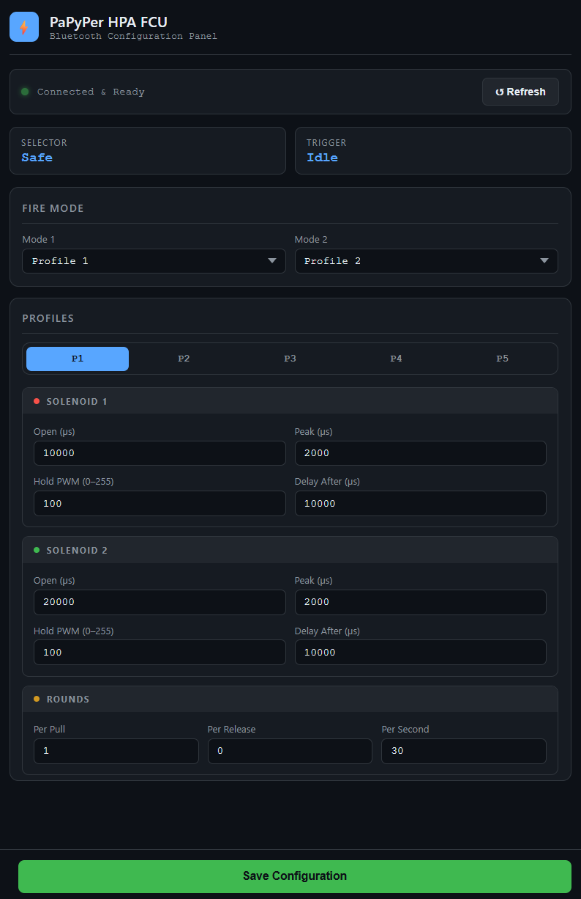

# PaPyPer HPA FCU ⚡

PaPyPer HPA FCU is an open-source Fire Control Unit designed for HPA (High Pressure Air) Airsoft replicas, powered by the **ESP32-C3** microcontroller (optimized for boards like the Seeed Studio XIAO).

This project features wireless configuration via **Bluetooth Low Energy (BLE)** directly through a web browser (Web Bluetooth API), completely eliminating the need for physical LCD screens or third-party mobile apps.

---

## 🌟 Key Features

* **Independent Dual Solenoid Control:** Supports separate timing adjustments for two solenoids (Nozzle & Poppet).
* **Solenoid Protection (Peak & Hold PWM):** Automatically reduces the holding current (Hold PWM) after the initial high-power opening phase (Peak), preventing solenoids from overheating during heavy use.
* **Smart Hall Sensor Support:** 
  * **Hall Trigger:** High-precision trigger pull detection with zero mechanical wear.
  * **Hall Selector:** Uses a magnet to switch between Safe, Semi, and Auto/Burst modes.
  * **Advanced Jitter Protection:** Integrated EMA filtering and dual-threshold hysteresis (Schmitt Trigger logic) to prevent double-firing and inconsistent pulls.
* **Web-Based Calibration:** Calibrate your Hall sensors (Trigger & Selector) directly from the web dashboard with one click.
* **5 Customizable Profiles:** Pre-configure up to 5 different firing profiles, saved permanently to the ESP32's non-volatile memory.
* **Multiple Firing Modes:** Supports Semi-Auto, Full-Auto, Burst (Rounds per pull), and Binary trigger (Rounds per release).
* **Web BLE Dashboard:** A modern web interface to adjust settings and monitor real-time sensor data.
* **Secure BLE Activation:** Bluetooth is off by default to save battery and prevent unauthorized access. It is activated via a specific hardware sequence.

---

## ⚙️ Pinout & Wiring

Designed for the **Seeed Studio XIAO ESP32-C3**:

| Name | Pin | Function | Configuration |
| :--- | :--- | :--- | :--- |
| **SOL1** | `D10` | Solenoid 1 Output (Requires MOSFET) | PWM (20kHz, 8-bit) |
| **SOL2** | `D3` | Solenoid 2 Output (Requires MOSFET) | PWM (20kHz, 8-bit) |
| **TRIGGER** | `D7` | Physical Trigger / BLE Toggle | Input Pullup |
| **MODE** | `D6` | Fire Selector (Physical Switch) | Input Pullup |
| **SAFE** | `D5` | Safe Selector (Physical Switch) | Input Pullup |
| **LED** | `D4` | Status LED | Output |
| **TRIG_HALL**| `D1` | Hall Effect Trigger | Analog Input |
| **SEL_HALL** | `D2` | Hall Effect Selector | Analog Input |

---

## 🚀 Usage & Configuration

### 1. Activating BLE Mode
Bluetooth is disabled by default for security and power saving. To toggle:
1. Switch the fire selector to **SAFE**.
2. Squeeze and hold the **Physical Trigger** (`D7`) for **5 seconds**.
3. The LED will blink rapidly, indicating `PaPyPer_FCU` is ready to connect.

### 2. Hall Sensor Calibration
If using Hall sensors (`USE_HALL_TRIGGER` or `USE_HALL_SELECTOR` set to `true` in `configs.h`):
1. Connect via the Web Dashboard.
2. **Selector:** Move your selector to each position (Safe, Semi, Auto) and click the corresponding **Calibrate** button on the UI.
3. **Trigger:** Release the trigger and click **Set Idle**, then pull it fully and click **Set Full**.
4. The system automatically calculates midpoints and direction (works even if the magnet is reversed).

### 3. Understanding Firing Parameters

Each profile allows you to fine-tune (all time values are in Microseconds - µs):

#### Solenoid 1 & 2 Settings
* **Open (µs):** Total time the valve stays open.
* **Peak (µs):** Duration of 100% power for fast initial opening.
* **Hold PWM (0-255):** Reduced power level after Peak (e.g., 100/255 ≈ 40%) to prevent overheating.
* **Delay After (µs):** Dwell time before the next action in the cycle.

#### Firing Mode Settings
* **Rounds Per Pull:** `1` for Semi, `3` for Burst, `-1` for Full Auto.
* **Rounds Per Release:** `1` or more for Binary trigger.
* **Rounds Per Second (RPS):** Limits the global rate of fire.
* **Hall Thresholds:** Adjustable **Fire** and **Release** percentages for the Hall Trigger to fine-tune sensitivity and prevent jitter.

---

## 🛠 Build Requirements
* **IDE:** Arduino IDE (v2.x) or VSCode with PlatformIO.
* **Board Core:** ESP32 Arduino Core (v3.0.0+ recommended).
* **Required Libraries:** 
  * `NimBLE-Arduino` (High-performance BLE stack).
  * `Preferences` (Internal storage).

---
*Created with ❤️ for the Airsoft HPA Community.*