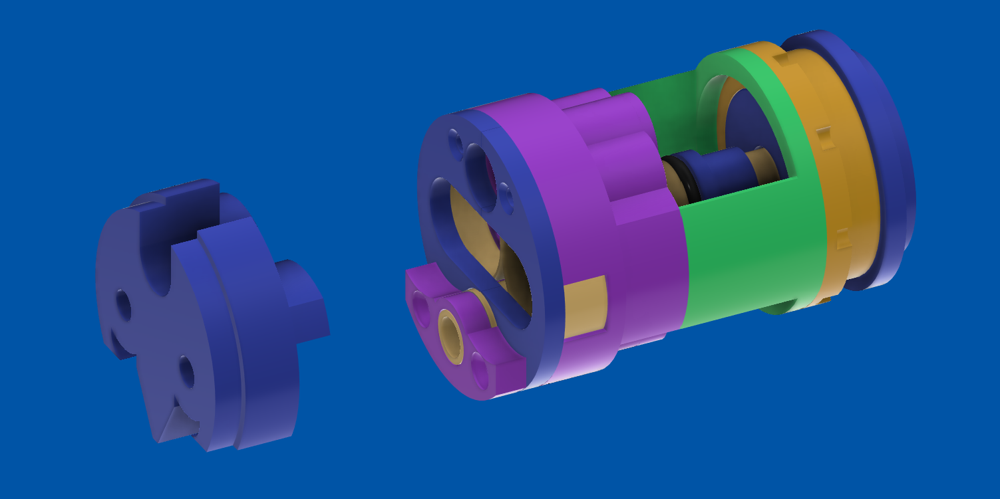
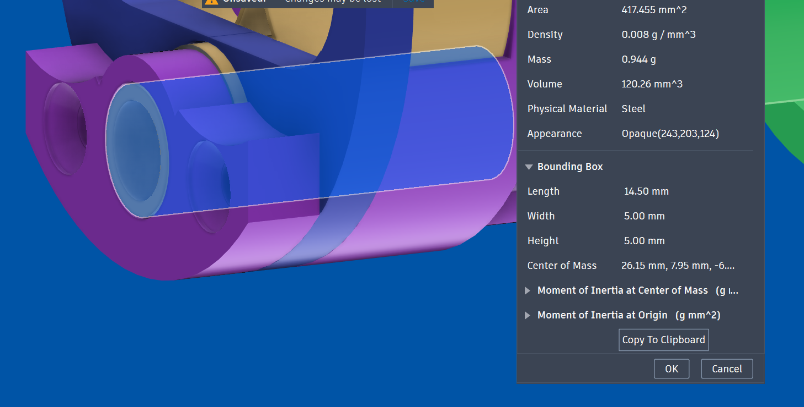

# Please check the size of brass inserts, brass/alu tube by this way:

# Accessories

## Brass Inserts (mm):
OD12.5xID12 (for solenoid plunger)
OD8xID7.5 (for poppet cylinder)
OD7.5xID7 (for piston cylinder)

## Brass Tube (mm)
OD5.5xID5 (for poppet body)
OD3xID1 (for solenoid seat orifice)

## Alu tube (mm)
OD5xID3 (for piston body, use alu for light weight than brass)

## Orings (mm)
OD7.5xID5.5 x 1 (for poppet)
OD8.5xID5.5 x 1 (for poppet)
OD7xID5 x 1 (for piston)
OD10xID(5.5/5.4/5.2) (for piston seal vs head)
For the oring seal the cap with head thread, find anything that work OD19 thick 1.2/1.3/1.4/1.5

# Note
The 2 white parts in step file are demostration how to pour AB epoxy glue